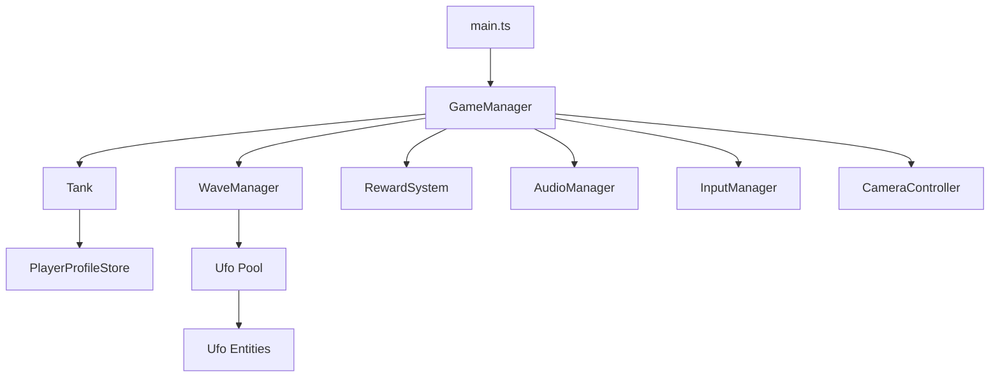

# Technical Architecture — Tank Shooter Pro

A modular overview of the game's TypeScript systems and Three.js rendering pipelines.

## System Architecture

## Core Modules & Components

### 1. Game Orchestrator (`src/core/GameManager.ts`)
- The central controller that initializes the Three.js WebGLRenderer, PerspectiveCamera, lights, and post-processing effects.
- Maintains the main game loop (`update`), tracking game state (`menu`, `playing`, `gameover`).
- Manages global list of active bullets, enemy bullets, power-ups, and UFOs.
- Coordinates UI state, overlay visibility, and statistical HUD updates.

### 2. Player Tank (`src/Tank.ts`)
- Manages the player's 3D mesh hierarchy (Base, Turret, Barrel Pivot, Barrel, Muzzle, and Shield).
- Customizes visual meshes and materials dynamically based on the active `BaseTank` class (Light, Medium, Heavy).
- Updates position using basic velocity-friction physics and resolves collisions against boundary limits (`[-60, 60]`) and pillars.
- Coordinates turret yaw (aligning with camera direction) and barrel pitch (aiming vertically towards the targeted 3D point).
- Handles bullet pool spawning and tracks special ability cooldown timers and duration timers.

### 3. Enemy AI (`src/Ufo.ts`)
- Represents UFO enemies. Relies on `src/config/balance.ts` for statistical parameters.
- Uses a simple state machine:
  - `SPAWN`: Entry animation (fade and spawn particles).
  - `CHASE`: Standard pursuit logic.
  - `ATTACK`: Class-specific attacks (e.g. Tank ramming charges, Spawner minion creation).
- Performs steering separation to prevent clustering.

### 4. Wave Management (`src/WaveManager.ts`)
- Decouples waves from the orchestrator.
- Dictates custom spawn rates, types of enemies, and timings for waves 1 to 5.
- Emits events to pause progression on Wave 5 victory, giving the player the option to start Endless Mode.

### 5. Profile Store & Economy (`src/PlayerProfileStore.ts`)
- Holds player state (XP, level, credits, nanobytes, upgrades, battle pass XP).
- Provides transaction methods (`spendCredits`, `spendNanobytes`) and upgrade purchases, writing results to LocalStorage.

### 6. Reward & Loot System (`src/core/RewardSystem.ts`)
- Dictates rewards based on defeated enemy types and current combo multipliers.
- Directly updates player profiles upon kill.
